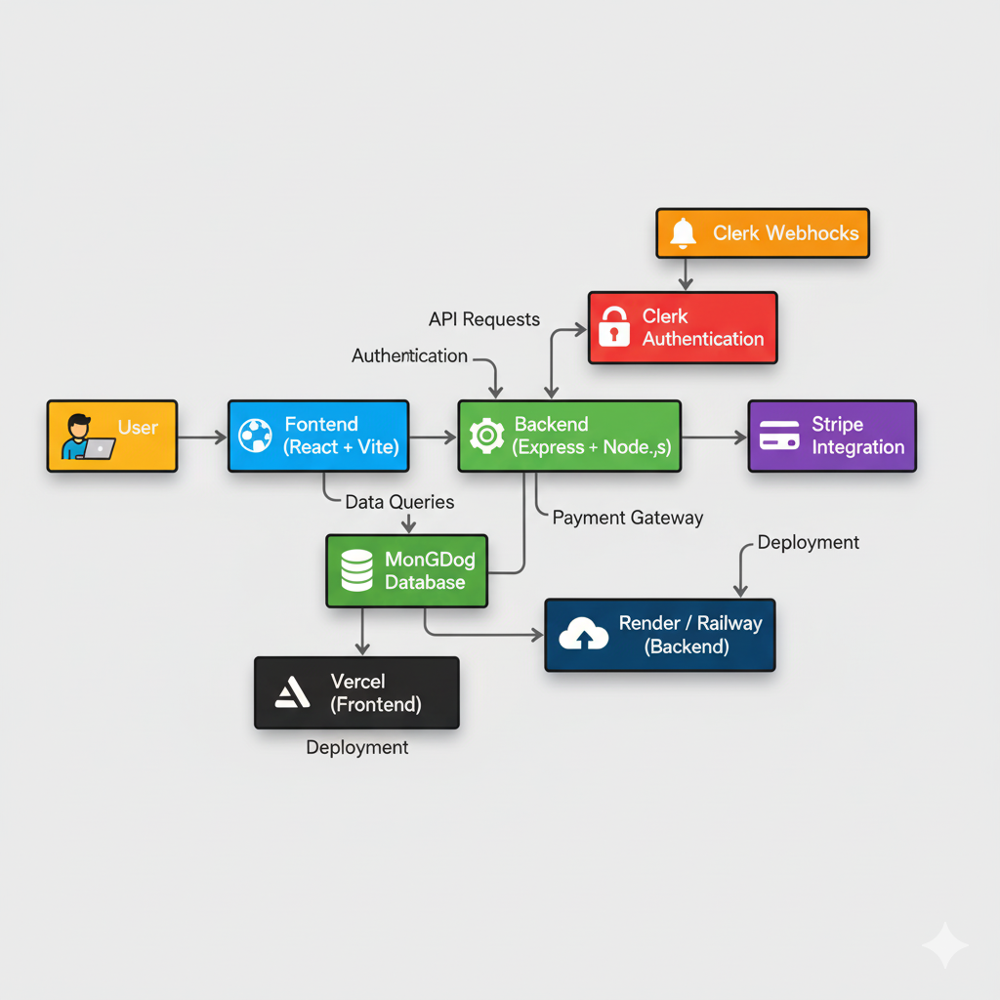

# 📘 GyanPath – Learning Management System (LMS)
(https://lms-frontend-five-sand.vercel.app/)


**GyanPath** is a full-stack **Learning Management System (LMS)** designed for both **students** and **educators**.  
Educators can create and manage courses, while learners can explore, enroll, and learn interactively — all in one place.  
Built using the **MERN stack**, it ensures a smooth, scalable, and responsive learning experience.

🔗 **Live Demo:** [https://lms-frontend-five-sand.vercel.app/](https://lms-frontend-five-sand.vercel.app/)

---

## 🗂️ Project Structure
```bash
Learning-management-system
├── client
│   ├── src
│   │   ├── assets
│   │   ├── components
│   │   │   ├── educator
│   │   │   └── student
│   │   ├── context
│   │   │   └── AppContext.jsx
│   │   ├── pages
│   │   │   ├── educator
│   │   │   └── student
│   │   ├── App.jsx
│   │   ├── index.css
│   │   └── main.jsx
│   ├── .env
│   ├── package.json
│   ├── tailwind.config.js
│   └── vite.config.js
│
└── server
    ├── configs
    │   ├── cloudinary.js
    │   ├── mongodb.js
    │   └── multer.js
    ├── controllers
    │   ├── courseController.js
    │   ├── educatorController.js
    │   ├── userController.js
    │   └── webhooks.js
    ├── middlewares
    │   └── authMiddleware.js
    ├── models
    │   ├── Course.js
    │   ├── CourseProgress.js
    │   ├── Purchase.js
    │   └── User.js
    ├── routes
    │   ├── courseRoute.js
    │   ├── educatorRoutes.js
    │   └── userRoutes.js
    ├── server.js
    ├── package.json
    └── .env
```

---

## ⚙️ Tech Stack

### **Frontend**
-  React.js (with Vite)
-  Tailwind CSS
-  Context API for global state management
-  Axios for API calls

### **Backend**
-  Node.js + Express.js
-  MongoDB with Mongoose
-  Cloudinary for media storage
-  Stripe for payments
-  Clerk for authentication
-  Multer for file handling

### **Deployment**
-  Vercel (Frontend)
-  Render / Railway (Backend)
-  MongoDB Atlas (Database)

---

##  Key Features

-  **Educator Dashboard:** Create, publish, and manage courses easily.  
-  **Student Dashboard:** Enroll, view lectures, and track learning progress.  
-  **Stripe Payment Integration:** Safe and secure payments for courses.  
-  **Video Preview Feature:** Preview before enrolling.  
-  **Cloudinary Integration:** Host images & videos efficiently.  
-  **Clerk Authentication:** Role-based login for students and educators.  
-  **Course Analytics:** Track revenue and student enrollments.  
-  **Scalable MERN Architecture:** Clean separation between client and server.

---

##  How to Run Locally

### 1️⃣ Clone the Repository
```bash
git clone https://github.com/SundaramDev/Learning-Management-System
cd Learning-management-system
```
### 2️⃣ Setup the Backend (Server)
```bash
cd server
npm install
```
#### Create a .env file inside server/:
```bash
MONGODB_URI=your_mongodb_connection_string
STRIPE_SECRET_KEY=your_stripe_secret_key
CLERK_SECRET_KEY=your_clerk_secret_key
CLOUDINARY_API_KEY=your_cloudinary_key
CLOUDINARY_API_SECRET=your_cloudinary_secret
CLOUDINARY_CLOUD_NAME=your_cloudinary_name
```
#### Then run:
```bash
npm run start
```
### 3️⃣ Setup the Frontend (Client)
```bash
cd ../client
npm install
```
#### Create a .env file inside client/:
```bash
VITE_BACKEND_URL=http://localhost:5000
VITE_CLERK_PUBLISHABLE_KEY=your_clerk_publishable_key
```
#### Then run:
```bash
npm run dev
```

### System Architecture



#### Your app will start at 👉 http://localhost:5173

##  Challenges & What We Learned

During this project, we learned how to:
- Integrate **Clerk Authentication** and **Stripe Payments**
- Manage file uploads using **Multer & Cloudinary**
- Structure a **MERN full-stack** project professionally
- Deploy client and server separately using **Vercel**


##  Get in Touch

We’re always open to collaborating on exciting projects or discussing new ideas in **Web Development**, **AI**, or **Automation**.  
Feel free to reach out or connect with us through the platforms below:

### 👥 Team Members

- **Sundaram**  
  - [Portfolio](https://portfolio-mu-ten-mzrtwnfksv.vercel.app/)  
  - [LinkedIn](https://www.linkedin.com/in/sundaram-5695b629a/)  
  - [GitHub](https://github.com/SundaramDev)  
  - 📧 [sundaram95802@gmail.com](mailto:sundaram95802@gmail.com)

- **Sambhav Mishra**  
  - [LinkedIn](https://www.linkedin.com/in/sambhav-mishra-6a815a2a4/)  
  - [GitHub](https://github.com/SambhavMishra8319)  
  - 📧 [23bds050@iiitdwd.ac.in](mailto:23bds050@iiitdwd.ac.in)

- **Aggimalla Abhishek**  
  - [LinkedIn](https://www.linkedin.com/in/aggimalla-abhishek-a8397829a/)  
  - [GitHub](https://github.com/AggimallaAbhishek)  
  - 📧 [23bds004@iiitdwd.ac.in](mailto:23bds004@iiitdwd.ac.in)

- **Nenavath Likhith Naik**  
  - [LinkedIn](https://www.linkedin.com/in/likhith-naik-14693b328/)  
  - [GitHub](https://github.com/Likhith-23)  
  - 📧 [23bds037@iiitdwd.ac.in](mailto:23bds037@iiitdwd.ac.in)

- **Doni Adithya**  
  - [LinkedIn](https://www.linkedin.com/in/doni-adithya-8551a3316/)  
  - [GitHub](#)  
  - 📧 [doni@example.com](mailto:doni@example.com)

---
## 💬 Final Note

“Great projects are built by great teams.”  
We’re proud to present our work on the **LMS Project**, aiming to simplify learning and management through smart technology.

Made with ❤️ by **Team LMS** — Sundaram, Sambhav, Likhith, Abhishek & Doni Aditya

